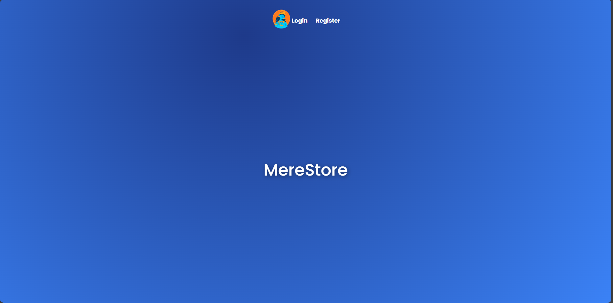
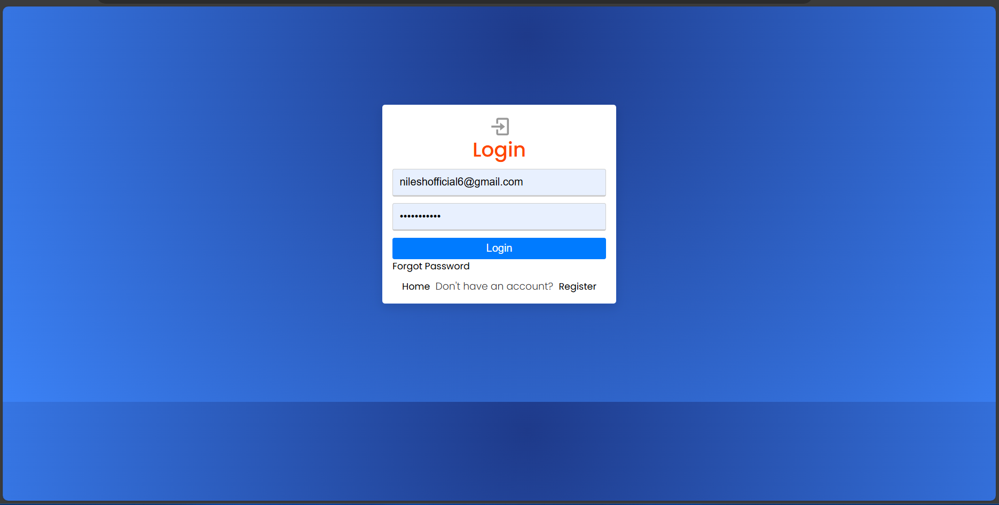
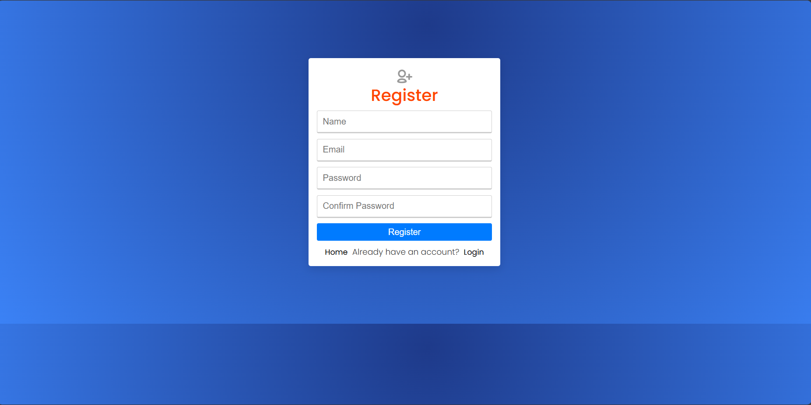
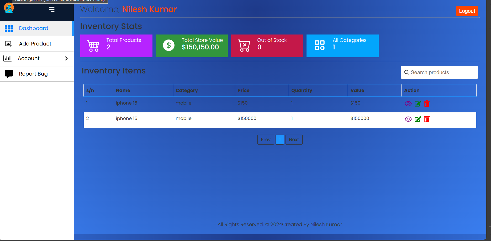
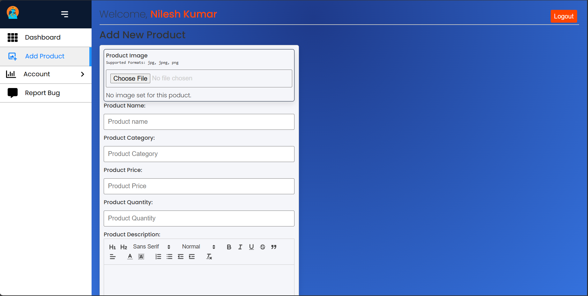
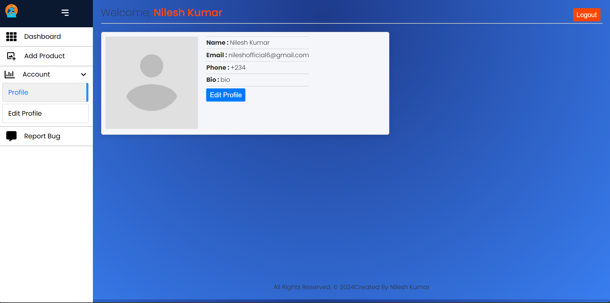

# MereStore - MERN Stack Application

## Overview
**MereStore** is a MERN stack application designed for user authentication and product management. It features user registration, login, logout, and product management functionalities. The application uses JWT for authentication, HttpOnly secure cookies for token storage, and integrates with the DummyJSON Product API. It also includes sorting and filtering functionalities, forgot password feature, and Redux for state management.

## Features
- **User Authentication:**
  - Register, login, and logout functionalities.
  - JWT-based authentication with HttpOnly secure cookies.
  - Forgot password functionality (optional).
- **Product Management:**
  - Fetch and display products from the DummyJSON API.
  - Create new products.
  - Delete existing products.
  - Sorting and filtering of products (optional).
- **State Management:**
  - Redux for managing user state and displaying user details.
- **UI/UX:**
  - Dark theme with gradient colors.
  - Responsive design with a dynamic Navbar.

## Installation

### Prerequisites
- Node.js and npm (or yarn) installed.
- MongoDB instance running.

### Client Installation

1. Navigate to the `client` directory:
   ```bash
   cd client
   ```

2. Install the dependencies:
   ```bash
   npm install
   ```

### Server Installation

1. Navigate to the `server` directory:
   ```bash
   cd server
   ```

2. Install the dependencies:
   ```bash
   npm install
   ```

### Environment Variables

Create a `.env` file in both `client` and `server` directories and add the following environment variables:

**Client `.env`:**
```plaintext
REACT_APP_API_URL=http://localhost:5000/api
```

**Server `.env`:**
```plaintext
MONGO_URI=<Your MongoDB URI>
JWT_SECRET=<Your JWT Secret>
```

## Running the Application

### Start the Server

1. Navigate to the `server` directory:
   ```bash
   cd server
   ```

2. Start the server:
   ```bash
   npm run dev
   ```

### Start the Client

1. Navigate to the `client` directory:
   ```bash
   cd client
   ```

2. Start the client:
   ```bash
   npm start
   ```

## Deployment

The application is deployed to [Github]. You can view the live demo [here](https://your-deployment-link.herokuapp.com).

## Screenshots

### Home Page


### Login Page


### Register Page


### Dashboard Page


### Add Product Page


### Profile Page


## Demo Video

Watch the demo video of the application running [here](demo.mp4).

## Code Quality

The code is organized and commented for better readability and maintainability. If you have any questions or feedback, feel free to open an issue or pull request.

## Contributing

Feel free to contribute by forking the repository and submitting pull requests.

## License

This project is licensed under the MIT License. See the [LICENSE](LICENSE) file for details.
